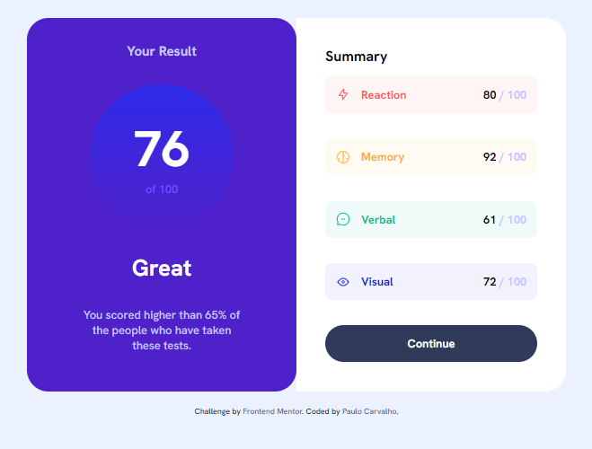

# Frontend Mentor - Results summary component solution

This is a solution to the [Results summary component challenge on Frontend Mentor](https://www.frontendmentor.io/challenges/results-summary-component-CE_K6s0maV). Frontend Mentor challenges help you improve your coding skills by building realistic projects. 

## Table of contents

  - [The challenge](#the-challenge)
  - [Screenshot](#screenshot)
  - [Links](#links)
  - [Author](#author)

### The challenge

O desafio é construir um componente de resumo de resultados e aproximá-lo o máximo possível do design.

### Screenshot

### Links

- Solution URL: [Add solution URL here]([https://your-solution-url.com](https://github.com/paulo1310/results-summary-component-main))
- Live Site URL: [Add live site URL here](https://your-live-site-url.com)

## Author

- Frontend Mentor - [@Paulo1310](https://www.frontendmentor.io/profile/paulo1310)
- Github - [@paulo1310](https://github.com/paulo1310)
